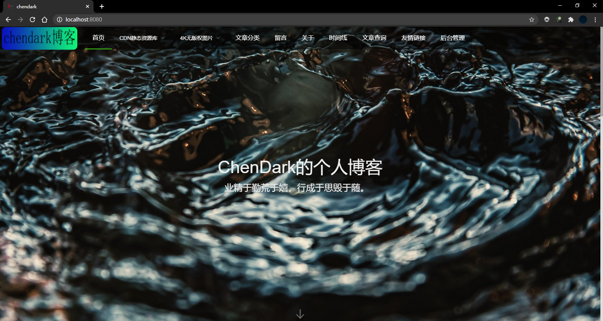
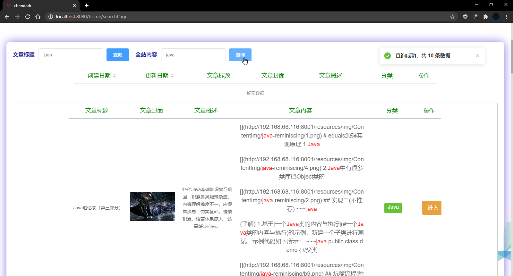
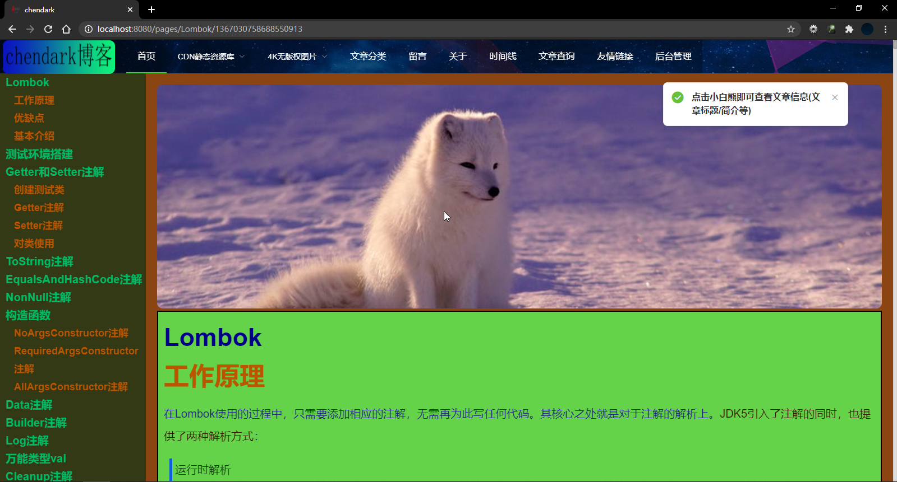
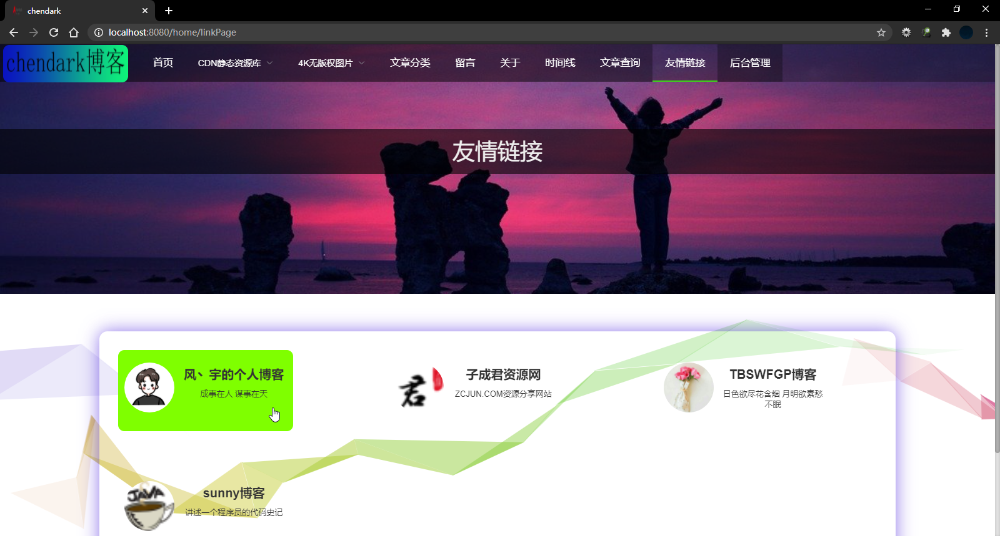

# 前言

1.之前一直使用**hexo**做为博客引擎然后上传至github来做静态博客网站，后部署至gitee。但由于站内文章越来越多，导致自己需要一套轻松便捷的博客管理系统来进行管理。

2.在B站上看到了[磕瓜的皮UP主的前后端分离个人博客项目](https://www.bilibili.com/video/BV15V411t7mC)，他这个项目的Github地址是：https://github.com/shuaigege1766/BlogV2.0。我觉得他这个网站的样式很漂亮，所以我就以该项目样式为模板用 element-plus + vue3.x 写了这个项目，原项目用的是 vuetify + vue2.x 实现的而且还是PC端和移动端都有，很厉害，我自愧不如，因为 element-plus 比较适合做PC端，再加上我自己也不会用手机来看文章所以就只写了PC端。

3.写博客的初心是为了能够**巩固知识，方便自己查漏补缺**，在需要的时候快速查询到相关知识点，很显然这一点 **ElasticSearch** 实现了，我可以用它来做一个全站搜索，快速定位到自己想要查看的笔记。

# 技术选型

- SpringBoot2.x后端
- SpringSecurity安全
- Mybatis-plus数据库
- Swagger2API接口文档
- Vue3.x前端
- Element-plus前端UI
- marked将md内容转为html代码
- ElasticSearch全站搜索
- docker部署

# 项目截图

## 前台

### 首页

### 留言

### 时间线

### 文章查询

### 文章页

### 友情链接

## 后台

### 后台首页

### 文件管理页

###  新建文章页

### 文章管理页

### 新建分类页

### 更新地址页

### 评论管理页

### 友情链接页

### 基本信息页

# 项目部署

...

